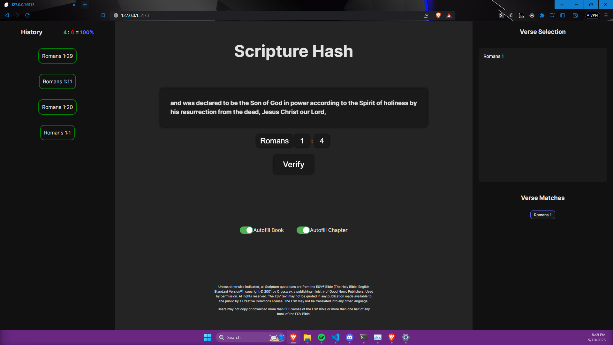

# Scripture Hash


## ESV API Proxy Server

[ESV API Proxy Server](https://github.com/MasterTemple/ESV-API-Proxy-Server) is used to fetch verses.

## Setup

```bash
npm install
npm run dev
```

## Screenshot


